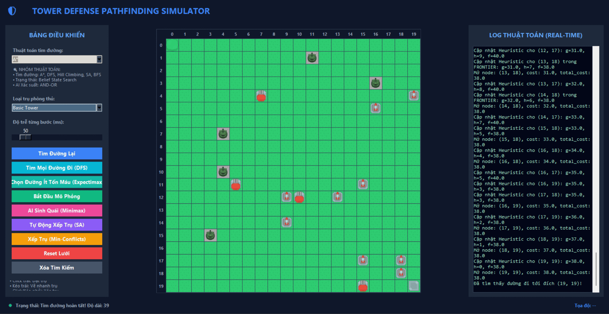

## 📌 Final project - Tower-Defense-AI

---

- **Thành viên thực hiện:**
  1. **Nguyễn Xuân Nhật** - MSSV: `24110293`
  2. **Nguyễn Anh Quân** - MSSV: `24110309`
  3. **Nguyễn Thành Huy** - MSSV: `24110222`
- **Môn:** Nhập môn Trí tuệ Nhân tạo
- **Dự án:** Tower Defense AI Visualizer

---

**Tổng quan dự án**

Dự án này triển khai một ứng dụng **Mô phỏng và Trực quan hóa các Thuật toán Tìm kiếm (Search Algorithms Visualizer)** áp dụng vào trò chơi **Thủ thành (Tower Defense)** kinh điển. 

Trong hệ thống mô phỏng này:
* **Bản đồ (Grid Map):** Được thiết kế dưới dạng lưới ô vuông kích thước $20 \times 20$ ô. Bản đồ bao gồm điểm xuất phát (Start) và điểm đích (Goal).
* **Quân địch (Creep/Agent):** Đóng vai trò là tác nhân (Agent) cần tìm đường đi tối ưu từ điểm Start để về đến Goal một cách an toàn nhất hoặc nhanh nhất.
* **Hệ thống phòng thủ (Towers):** Người chơi có thể xây dựng các tháp phòng thủ gồm tháp cơ bản (**Basic Tower**), tháp lửa (**Fire Tower**), và tháp băng (**Ice Tower**). Các tháp này tạo ra các chướng ngại vật vật lý (không thể đi qua) hoặc các vùng ảnh hưởng gây sát thương và làm chậm Creep.
* **Giao diện trực quan hóa (GUI):** Được xây dựng bằng thư viện **Tkinter (Python)**, cung cấp bảng điều khiển trực quan để người dùng có thể:
  * Vẽ chướng ngại vật và đặt các loại tháp phòng thủ trên bản đồ lưới.
  * Lựa chọn và chạy thử nghiệm **18 thuật toán tìm kiếm** chia làm **6 nhóm lớn** từ cơ bản đến nâng cao.
  * Quan sát trực tiếp quá trình duyệt trạng thái: các ô đang nằm trong hàng đợi khám phá (màu xanh nước biển - **Open**), các ô đã duyệt qua (màu đỏ/xám - **Closed**), và đường đi cuối cùng được tìm thấy (màu vàng/cam - **Path**).
  * Điều chỉnh tốc độ mô phỏng thông qua thanh trượt tốc độ (delay).

---

## 📂 Cấu trúc thư mục dự án

```text
Tower-Defense-AI/
├── tower_defense_sim/
│   ├── algorithms/                       # Thư mục chứa mã nguồn của 18 thuật toán cốt lõi
│   │   ├── __init__.py
│   │   ├── bfs.py                        # Breadth-First Search
│   │   ├── dfs.py                        # Depth-First Search
│   │   ├── UCS.py                        # Uniform Cost Search
│   │   ├── astar.py                      # A* Search
│   │   ├── IDAstar.py                    # Iterative Deepening A* (IDA*)
│   │   ├── greedy_best_first.py          # Greedy Best-First Search
│   │   ├── hill_climbing.py              # Hill Climbing (Leo đồi)
│   │   ├── Local_Beam_Search.py          # Local Beam Search (Tìm kiếm chùm tia)
│   │   ├── simulated_annealing.py        # Simulated Annealing (Luyện kim giả lập)
│   │   ├── and_or.py                     # AND-OR Graph Search
│   │   ├── DFS_Searching_for_partially_observable_problems.py # DFS cho môi trường bán quan sát
│   │   ├── belief_state_search.py        # Belief State Search (Tìm kiếm trạng thái niềm tin)
│   │   ├── min_conflicts.py              # Min-Conflicts (Giải CSP đặt tháp phòng thủ)
│   │   ├── backtracking.py               # Backtracking Search (CSP tìm đường)
│   │   ├── forward_checking.py           # Forward Checking (CSP tìm đường)
│   │   ├── minimax.py                    # Minimax (Đối kháng xây tháp - thả quái)
│   │   ├── alpha_beta.py                 # Alpha-Beta Pruning (Tìm đường né tháp)
│   │   └── expectimax.py                 # Expectimax (Định tuyến tránh sát thương kỳ vọng)
│   │
│   ├── assets/                           # Chứa các tài nguyên hình ảnh và tile của trò chơi
│   │   ├── Default size/
│   │   ├── Retina/
│   │   ├── analyze_tiles.py
│   │   ├── find_assets.py
│   │   ├── generate_tile_viewer.py
│   │   └── tile_viewer.html
│   │
│   ├── gui.py                            # Giao diện đồ họa chính của trò chơi (Tkinter Dashboard)
│   ├── main.py                           # Điểm chạy chương trình chính (Khởi tạo Map, Pathfinder và GUI)
│   ├── map_manager.py                    # Quản lý lưới ô vuông, tọa độ tháp, chướng ngại vật và sát thương
│   ├── path_step_monitor.py              # Monitor theo dõi trạng thái node và xuất logs từng bước lên giao diện
│   ├── pathfinder.py                     # Điều phối viên định tuyến liên kết giữa GUI và các mô-đun thuật toán
│   └── test_algorithms.py                # File kịch bản kiểm thử tính đúng đắn của các thuật toán
│
├── .gitignore
└── README.md                             # Tài liệu giới thiệu dự án (File này)
```

---

## 🛠️ Chi tiết các nhóm thuật toán

Dưới đây là đặc tả chi tiết của 18 thuật toán tìm kiếm được triển khai trong hệ thống, chia thành 6 nhóm lớn theo cấu trúc bài học.

---

### Nhóm 1: Uninformed Search (Tìm kiếm không thông tin / Tìm kiếm mù)

Các thuật toán tìm kiếm mù duyệt qua không gian trạng thái mà không có bất kỳ thông tin nào về khoảng cách hay chi phí ước lượng đến đích ngoại trừ định nghĩa bài toán.

#### 1. BFS (Breadth-First Search - Tìm kiếm theo chiều rộng)
* **Khái niệm:** Duyệt qua các nút theo từng cấp độ sâu. Sử dụng một cấu trúc dữ liệu hàng đợi FIFO (First In First Out) để đảm bảo khám phá tất cả các nút ở độ sâu $d$ trước khi đi xuống độ sâu $d+1$.
* **Mã giả (Pseudo-code):**
  ```python
  def BFS(start, goal, grid):
      frontier = Queue([start]) # Hàng đợi FIFO
      reached = {start}
      parent = {start: None}
      while not frontier.is_empty():
          node = frontier.pop()
          if node == goal:
              return reconstruct_path(parent, goal)
          for child in grid.get_neighbors(node):
              if child not in reached:
                  reached.add(child)
                  parent[child] = node
                  frontier.push(child)
      return None
  ```
* **Ưu điểm:** Đầy đủ (Complete) và luôn tìm thấy đường đi ngắn nhất (Tối ưu - Optimal) nếu chi phí của mỗi bước đi là bằng nhau (đều là 1 đơn vị bước trên lưới).
* **Độ phức tạp thời gian:** $O(b^d)$ (với $b$ là hệ số nhánh, $d$ là độ sâu của lời giải).
* **Độ phức tạp không gian:** $O(b^d)$ (phải lưu toàn bộ các nút đã mở và các nút trong hàng đợi biên).

#### 2. DFS (Depth-First Search - Tìm kiếm theo chiều sâu)
* **Khái niệm:** Khám phá sâu nhất có thể trên mỗi nhánh trước khi quay lui. Sử dụng cấu trúc dữ liệu ngăn xếp LIFO (Last In First Out), trong thực tế thường được triển khai thông qua đệ quy hoặc ngăn xếp tường minh.
* **Mã giả (Pseudo-code):**
  ```python
  def DFS(start, goal, grid):
      frontier = Stack([start]) # Ngăn xếp LIFO
      explored = Set()
      parent = {start: None}
      while not frontier.is_empty():
          node = frontier.pop()
          if node == goal:
              return reconstruct_path(parent, goal)
          if node not in explored:
              explored.add(node)
              for child in grid.get_neighbors(node):
                  if child not in explored and child not in frontier:
                      parent[child] = node
                      frontier.push(child)
      return None
  ```
* **Ưu điểm:** Tiết kiệm bộ nhớ hơn BFS rất nhiều khi không gian trạng thái sâu nhưng hẹp.
* **Độ phức tạp thời gian:** $O(b^m)$ (với $m$ là độ sâu lớn nhất của cây tìm kiếm).
* **Độ phức tạp không gian:** $O(b \cdot m)$ (chỉ cần lưu trữ đường đi hiện tại và các nút lân cận chưa duyệt).

#### 3. UCS (Uniform Cost Search - Tìm kiếm chi phí đồng nhất)
* **Khái niệm:** Mở rộng nút có chi phí đường đi lũy kế $g(n)$ nhỏ nhất. Sử dụng một hàng đợi ưu tiên (Priority Queue) sắp xếp tăng dần theo $g(n)$.
* **Mã giả (Pseudo-code):**
  ```python
  def UCS(start, goal, grid):
      frontier = PriorityQueue() # Sắp xếp theo g(n)
      frontier.push(start, cost=0.0)
      reached = {start: 0.0}
      parent = {start: None}
      while not frontier.is_empty():
          node, g = frontier.pop()
          if node == goal:
              return reconstruct_path(parent, goal)
          for child in grid.get_neighbors(node):
              g_new = g + step_cost(node, child)
              if child not in reached or g_new < reached[child]:
                  reached[child] = g_new
                  parent[child] = node
                  frontier.push(child, cost=g_new)
      return None
  ```
* **Ưu điểm:** Đầy đủ và luôn đảm bảo tìm ra đường đi tối ưu với chi phí tích lũy nhỏ nhất ngay cả khi các ô đi qua có trọng số chi phí khác nhau.
* **Độ phức tạp thời gian:** $O(b^{1 + \lfloor C^* / \epsilon \rfloor})$ (với $C^*$ là chi phí tối ưu, $\epsilon$ là chi phí tối thiểu của mỗi bước đi).
* **Độ phức tạp không gian:** $O(b^{1 + \lfloor C^* / \epsilon \rfloor})$ (lưu trữ tất cả các nút trong hàng đợi ưu tiên).

---

### Nhóm 2: Informed Search (Tìm kiếm có thông tin / Heuristic)

Các thuật toán sử dụng tri thức bổ sung về bài toán thông qua hàm ước lượng khoảng cách $h(n)$ (Heuristic) để định hướng tìm kiếm thông minh hơn về phía mục tiêu.

#### 1. A* Search (Tìm kiếm A sao)
* **Khái niệm:** Đánh giá các nút bằng hàm tổng chi phí $f(n) = g(n) + h(n)$, với $g(n)$ là chi phí thực tế từ Start đến nút $n$, và $h(n)$ là chi phí ước lượng (Manhattan) từ $n$ đến Goal.
* **Mã giả (Pseudo-code):**
  ```python
  def A_Star(start, goal, grid):
      frontier = PriorityQueue() # Sắp xếp theo f(n) = g(n) + h(n)
      frontier.push(start, priority=h(start, goal))
      reached = {start: 0.0}
      parent = {start: None}
      while not frontier.is_empty():
          node = frontier.pop()
          if node == goal:
              return reconstruct_path(parent, goal)
          for child in grid.get_neighbors(node):
              g_new = reached[node] + step_cost(node, child)
              if child not in reached or g_new < reached[child]:
                  reached[child] = g_new
                  f_new = g_new + h(child, goal)
                  parent[child] = node
                  frontier.push(child, priority=f_new)
      return None
  ```
* **Ưu điểm:** Đầy đủ và tối ưu nhất (nếu hàm heuristic là chấp nhận được - admissible và nhất quán - consistent). Tránh mở rộng các nhánh đi chệch hướng mục tiêu.
* **Độ phức tạp thời gian:** $O(b^d)$ (phụ thuộc vào chất lượng hàm heuristic, trường hợp tốt nhất có thể là tuyến tính).
* **Độ phức tạp không gian:** $O(b^d)$ (lưu trữ toàn bộ các nút trong bộ nhớ).

#### 2. IDA* (Iterative Deepening A* - Tìm kiếm A* độ sâu dần)
* **Khái niệm:** Kết hợp kỹ thuật tìm kiếm sâu dần (Iterative Deepening) với bộ lọc giới hạn dựa trên giá trị $f(n)$. Tại mỗi lượt lặp, thuật toán thực hiện DFS nhưng cắt tỉa bất kỳ nhánh nào có $f(n)$ vượt quá một ngưỡng giới hạn `threshold`. Nếu không tìm thấy đích, ngưỡng này sẽ được nâng lên bằng giá trị $f(n)$ nhỏ nhất đã bị cắt tỉa ở lượt lặp trước.
* **Mã giả (Pseudo-code):**
  ```python
  def IDA_Star(start, goal, grid):
      threshold = h(start, goal)
      while True:
          temp_limit, path = DLS_A_Star(start, goal, 0.0, threshold, [start], set())
          if path is not None:
              return path
          if temp_limit == infinity:
              return None
          threshold = temp_limit

  def DLS_A_Star(node, goal, g, threshold, path, visited):
      f = g + h(node, goal)
      if f > threshold:
          return f, None
      if node == goal:
          return f, path
      min_val = infinity
      for neighbor in sorted(grid.get_neighbors(node), key=lambda x: h(x, goal)):
          if neighbor not in path:
              path.append(neighbor)
              t, found_path = DLS_A_Star(neighbor, goal, g + 1.0, threshold, path, visited)
              if found_path is not None:
                  return t, found_path
              if t < min_val:
                  min_val = t
              path.pop()
      return min_val, None
  ```
* **Ưu điểm:** Tiết kiệm bộ nhớ vượt trội so với A* truyền thống vì sử dụng DFS đệ quy, không gian bộ nhớ chỉ tăng tuyến tính theo độ dài đường đi.
* **Độ phức tạp thời gian:** $O(b^d)$ (có thể duyệt lặp lại các nút ở tầng nông nhưng thực tế vẫn rất nhanh).
* **Độ phức tạp không gian:** $O(b \cdot d)$ (tuyến tính theo độ sâu lời giải).

#### 3. Greedy Best-First Search (Tìm kiếm tham lam tốt nhất)
* **Khái niệm:** Lựa chọn mở rộng nút tiếp theo chỉ dựa trên hàm ước lượng khoảng cách $h(n)$ để tiến nhanh nhất đến mục tiêu.
* **Mã giả (Pseudo-code):**
  ```python
  def Greedy_Best_First(start, goal, grid):
      frontier = PriorityQueue() # Sắp xếp chỉ theo h(n)
      frontier.push(start, priority=h(start, goal))
      reached = {start}
      parent = {start: None}
      while not frontier.is_empty():
          node = frontier.pop()
          if node == goal:
              return reconstruct_path(parent, goal)
          for child in grid.get_neighbors(node):
              if child not in reached:
                  reached.add(child)
                  parent[child] = node
                  frontier.push(child, priority=h(child, goal))
      return None
  ```
* **Ưu điểm:** Tốc độ tìm kiếm cực nhanh nếu có hàm Heuristic tốt và bản đồ ít chướng ngại vật phức tạp.
* **Độ phức tạp thời gian:** $O(b^m)$ (ở trường hợp xấu nhất có thể rơi vào các vòng lặp hoặc ngõ cụt), nhưng trung bình rất tốt.
* **Độ phức tạp không gian:** $O(b^m)$ (lưu trữ các nút trong hàng đợi biên).

---

### Nhóm 3: Local Search (Tìm kiếm cục bộ)

Tập trung vào tối ưu hóa trạng thái hiện tại hoặc trạng thái lân cận thay vì lưu trữ và tìm đường đi từ gốc.

#### 1. Local Beam Search (Tìm kiếm chùm tia cục bộ)
* **Khái niệm:** Theo dõi $k$ trạng thái tốt nhất song song thay vì chỉ một trạng thái như Leo đồi. Ở mỗi bước, tất cả các trạng thái lân cận của cả $k$ chùm tia được sinh ra, sau đó chỉ chọn ra $k$ trạng thái có Heuristic tốt nhất để tạo thành chùm tia mới.
* **Mã giả (Pseudo-code):**
  ```python
  def Local_Beam_Search(start, goal, grid, k=4):
      beam = [(h(start, goal), [start])]
      while True:
          for score, path in beam:
              if path[-1] == goal:
                  return path
          successors = []
          for score, path in beam:
              curr = path[-1]
              for neighbor in grid.get_neighbors(curr):
                  if neighbor not in path:
                      successors.append((h(neighbor, goal), path + [neighbor]))
          if not successors:
              return None
          # Sắp xếp chọn k ứng viên tốt nhất và không trùng lặp nút cuối
          successors.sort(key=lambda x: x[0])
          beam = filter_unique_ends(successors)[:k]
  ```
* **Ưu điểm:** Khám phá song song giúp giảm thiểu đáng kể nguy cơ bị mắc kẹt ở cực trị địa phương (local maxima) so với leo đồi đơn lẻ.
* **Độ phức tạp thời gian:** $O(k \cdot b \cdot m)$ (với $m$ là số bước đi tối đa).
* **Độ phức tạp không gian:** $O(k \cdot b)$ (chỉ lưu trữ $k$ trạng thái và tập con lân cận của chúng).

#### 2. Simulated Annealing (Luyện kim giả lập)
* **Khái niệm:** Kết hợp leo đồi với việc nhảy ngẫu nhiên. Nếu trạng thái tiếp theo tốt hơn (giảm khoảng cách), chấp nhận ngay lập tức. Nếu tệ hơn, vẫn chấp nhận với một xác suất $p = e^{-\Delta E / T}$, trong đó $T$ là nhiệt độ giảm dần theo thời gian.
* **Mã giả (Pseudo-code):**
  ```python
  def Simulated_Annealing(start, goal, grid, schedule):
      current = start
      path = [start]
      visited = {start}
      T = 100.0
      while current != goal:
          T = schedule(T)
          if T <= 0.1: return path if path[-1] == goal else None
          neighbors = [n for n in grid.get_neighbors(current) if n not in visited]
          if not neighbors:
              # Quay lui (backtrack) nếu rơi vào ngõ cụt
              path.pop()
              current = path[-1]
              continue
          next_node = random.choice(neighbors)
          delta = h(next_node, goal) - h(current, goal)
          if delta < 0: # Tốt hơn
              current = next_node
              visited.add(current)
              path.append(current)
          else:
              p = exp(-delta / T)
              if random.random() < p: # Chấp nhận trạng thái tệ hơn
                  current = next_node
                  visited.add(current)
                  path.append(current)
      return path
  ```
* **Ưu điểm:** Có khả năng thoát khỏi các bẫy cực trị địa phương nhờ các bước nhảy ngẫu nhiên được điều khiển bởi nhiệt độ $T$. Có khả năng hội tụ về tối ưu toàn cục.
* **Độ phức tạp thời gian:** Phụ thuộc vào kịch bản giảm nhiệt độ (cooling schedule).
* **Độ phức tạp không gian:** $O(1)$ nếu chỉ lưu trạng thái hiện tại (hoặc $O(d)$ để lưu vết đường đi đã đi qua).

#### 3. Hill Climbing (Steepest-Ascent Hill Climbing - Leo đồi dốc đứng)
* **Khái niệm:** Tại mỗi bước, duyệt qua toàn bộ các trạng thái lân cận của nút hiện tại và chọn ô lân cận có giá trị Heuristic tốt nhất (khoảng cách đến đích ngắn nhất). Nếu không có ô lân cận nào tốt hơn trạng thái hiện tại, thuật toán dừng lại (đạt cực đại địa phương). Dự án tích hợp cơ chế ghi nhớ các ô đã đi qua (`visited_cells`) để giúp vượt qua cực đại địa phương/cao nguyên.
* **Mã giả (Pseudo-code):**
  ```python
  def Hill_Climbing(start, goal, grid):
      current = start
      path = [start]
      visited = {start}
      while current != goal:
          neighbors = [n for n in grid.get_neighbors(current) if n not in visited]
          if not neighbors:
              return None
          # Chọn nút lân cận tốt nhất
          best_neighbor = min(neighbors, key=lambda n: h(n, goal))
          if h(best_neighbor, goal) >= h(current, goal):
              # Vẫn tiếp tục đi nhưng log cảnh báo cực đại địa phương
              pass
          current = best_neighbor
          visited.add(current)
          path.append(current)
      return path
  ```
* **Ưu điểm:** Cực kỳ tiết kiệm bộ nhớ, tính toán nhanh vì chỉ đưa ra quyết định cục bộ dựa trên thông tin tức thời của các ô lân cận.
* **Độ phức tạp thời gian:** Phụ thuộc cấu trúc không gian trạng thái; dễ kẹt ở cao nguyên hoặc cực đại cục bộ nếu không có cơ chế hỗ trợ.
* **Độ phức tạp không gian:** $O(1)$ bộ nhớ động.

---

### Nhóm 4: Search in Complex Environments (Tìm kiếm trong môi trường phức tạp)

Giải quyết các bài toán khi môi trường có tính bất định, bán quan sát hoặc không cảm biến (robot không biết vị trí ban đầu của mình).

#### 1. AND-OR Graph Search (Tìm kiếm đồ thị VÀ-HOẶC)
* **Khái niệm:** Dùng để lập kế hoạch trong môi trường bất định. Ở đây, hành động của Creep (di chuyển) dẫn tới các kết quả khác nhau do tháp Băng làm chậm ngẫu nhiên (nút AND biểu diễn các trạng thái môi trường: "slowed" hoặc "normal"). Tác nhân chọn hướng đi (nút OR) sao cho bất kể môi trường xảy ra trường hợp nào (bị làm chậm hay bình thường) thì vẫn luôn có phương án dự phòng để về đích.
* **Mã giả (Pseudo-code):**
  ```python
  def AND_OR_Graph_Search(problem):
      return or_search(problem.initial_state, problem, [])

  def or_search(state, problem, path):
      if problem.goal_test(state): return {}
      if state in path: return failure
      for action in problem.actions(state):
          plan = and_search(problem.results(state, action), problem, path + [state])
          if plan != failure:
              return {action: plan}
      return failure

  def and_search(states, problem, path):
      plan = {}
      for s in states:
          plan_s = or_search(s, problem, path)
          if plan_s == failure: return failure
          plan[s] = plan_s
      return plan
  ```
* **Ưu điểm:** Đưa ra được giải pháp kế hoạch dự phòng (Contingency Plan) bao quát mọi trường hợp ngẫu nhiên của môi trường phòng thủ.
* **Độ phức tạp thời gian:** Phụ thuộc lũy thừa theo độ sâu và hệ số phân nhánh của cả nút VÀ lẫn nút HOẶC.
* **Độ phức tạp không gian:** Lưu trữ cấu trúc cây chiến lược khá lớn.

#### 2. DFS Searching for Partially Observable Problems (DFS trong môi trường bán quan sát)
* **Khái niệm:** Giải quyết bài toán khi Agent chỉ quan sát được một phần môi trường (không biết chính xác mình ở ô nào mà chỉ có một tập hợp các ô khả thi - trạng thái niềm tin). Sử dụng DFS để tìm chuỗi hành động đưa mọi khả năng trong trạng thái niềm tin hội tụ về đích.
* **Mã giả (Pseudo-code):**
  ```python
  def DFS_Partially_Observable(start, goal, grid):
      initial_belief = frozenset([start])
      frontier = Stack([(initial_belief, [])]) # (Trạng thái niềm tin, Chuỗi hành động)
      visited = {initial_belief}
      while not frontier.is_empty():
          curr_belief, path_actions = frontier.pop()
          if curr_belief == frozenset([goal]):
              return reconstruct_path_from_actions(start, path_actions, grid)
          for action in ['U', 'D', 'L', 'R']:
              next_belief = predict_belief_state(curr_belief, action, grid)
              if next_belief not in visited:
                  visited.add(next_belief)
                  frontier.push((next_belief, path_actions + [action]))
      return None
  ```
* **Ưu điểm:** Đảm bảo đưa ra chuỗi hành động hành trình an toàn bất kể vị trí thực tế của robot nằm ở đâu trong tập trạng thái niềm tin ban đầu.
* **Độ phức tạp thời gian:** $O(b^P)$ với $P$ là số lượng trạng thái niềm tin (tối đa là $2^N$ trạng thái vật lý của lưới ô vuông).
* **Độ phức tạp không gian:** $O(2^N)$ bộ nhớ để lưu trữ các trạng thái niềm tin đã duyệt.

#### 3. Belief State Search (Tìm kiếm trạng thái niềm tin bằng BFS)
* **Khái niệm:** Tương tự như trên nhưng sử dụng thuật toán duyệt rộng BFS trên không gian các trạng thái niềm tin (Belief States). Agent xuất phát với giả định có thể đứng ở bất kỳ vị trí xuất phát nào trong danh sách ứng viên, tìm kiếm chuỗi hành động tối ưu ngắn nhất để đưa toàn bộ các khả năng hội tụ về duy nhất ô Goal.
* **Mã giả (Pseudo-code):**
  ```python
  def Belief_State_Search(possible_starts, goal, grid):
      initial_belief = frozenset(possible_starts)
      queue = Queue([(initial_belief, [])])
      visited = {initial_belief}
      while not queue.is_empty():
          curr_belief, path_actions = queue.pop()
          if curr_belief == frozenset([goal]):
              return path_actions
          for action in ['U', 'D', 'L', 'R']:
              next_belief = predict_belief_state(curr_belief, action, grid)
              if next_belief not in visited:
                  visited.add(next_belief)
                  queue.push((next_belief, path_actions + [action]))
      return []
  ```
* **Ưu điểm:** Tìm ra chuỗi hành động hội tụ ngắn nhất (tối ưu số bước đi) so với DFS trong môi trường mù thông tin cảm biến hoàn toàn.
* **Độ phức tạp thời gian:** $O(b^P)$ (trong đó $P \le 2^N$).
* **Độ phức tạp không gian:** $O(2^N)$ để lưu trữ hàng đợi biên của các trạng thái niềm tin.

---

### Nhóm 5: Constraint Satisfaction Problems (CSP - Bài toán thỏa mãn ràng buộc)

Mô hình hóa bài toán dưới dạng các biến (Variables) cần nhận các giá trị (Values) trong miền giá trị (Domains) sao cho thỏa mãn các ràng buộc (Constraints) đề ra.

#### 1. Min-Conflicts (Giải thuật xung đột tối thiểu)
* **Khái niệm:** Dùng để cấu hình vị trí tháp phòng thủ. Hệ thống cần đặt 18 trụ phòng thủ ngẫu nhiên trên bản đồ sao cho: Không đè nhau, không đè lên Start/Goal, và quan trọng nhất là không chặn đứng đường đi từ Start đến Goal (kiểm tra đường đi bằng A*). Bắt đầu từ một cấu hình ngẫu nhiên đầy đủ, tại mỗi bước chọn ngẫu nhiên một biến tháp bị lỗi (xung đột) và gán cho nó giá trị (tọa độ ô lưới) làm giảm thiểu số lượng xung đột nhất.
* **Mã giả (Pseudo-code):**
  ```python
  def Min_Conflicts(csp, max_steps):
      current = initial_complete_assignment(csp)
      for step in range(max_steps):
          conflicted = get_conflicted_variables(current, csp)
          if not conflicted:
              return current
          var = random_select(conflicted)
          best_val = argmin(csp.domains[var], key=lambda val: count_conflicts(var, val, current, csp))
          current[var] = best_val
      return current
  ```
* **Ưu điểm:** Cực kỳ hiệu quả đối với các bài toán phân bổ tài nguyên hoặc lập lịch quy mô lớn, tìm ra lời giải hợp lệ rất nhanh so với duyệt cây đệ quy.
* **Độ phức tạp thời gian:** $O(k \cdot n)$ với $k$ là số bước lặp tối đa và $n$ là số lượng tháp cần đặt.
* **Độ phức tạp không gian:** $O(n)$ để lưu trữ phép gán hiện tại.

#### 2. Backtracking Search (Tìm kiếm quay lui trong CSP)
* **Khái niệm:** Áp dụng cho định tuyến (tìm đường):
  * **Biến (Variables):** Các ô bước đi kế tiếp trên đường đi $X_1, X_2, \dots, X_p$.
  * **Miền giá trị (Domain):** Các ô lân cận 4 hướng của ô trước đó.
  * **Ràng buộc (Constraints):** Không đè lên chướng ngại vật/tháp phòng thủ, nằm trong bản đồ, và không quay lại các ô đã đi qua trong phép gán (đường đi hiện tại) hoặc ô đã thất bại (`visited_nodes`).
* **Mã giả (Pseudo-code):**
  ```python
  def Backtracking_Search(csp):
      return backtrack([], csp)

  def backtrack(assignment, csp):
      if is_complete(assignment, csp):
          return assignment
      var = select_next_variable(assignment, csp)
      for value in csp.domains[var]:
          if is_consistent(value, assignment, csp):
              assignment.append(value)
              result = backtrack(assignment, csp)
              if result is not None:
                  return result
              assignment.pop() # Backtrack
      return None
  ```
* **Ưu điểm:** Đơn giản, đảm bảo quét và tìm ra lời giải hợp lệ tuân thủ các ràng buộc nếu tồn tại lời giải trên bản đồ.
* **Độ phức tạp thời gian:** $O(d^n)$ ở trường hợp xấu nhất ($d$ là kích thước miền giá trị - các ô lân cận, $n$ là số biến).
* **Độ phức tạp không gian:** $O(n)$ (độ sâu đệ quy lớn nhất bằng số biến).

#### 3. Forward Checking (Duyệt quay lui kết hợp kiểm tra trước)
* **Khái niệm:** Cải tiến của Backtracking. Tại mỗi bước gán ô tọa độ mới cho đường đi, thuật toán thực hiện **Forward Checking** bằng cách chạy một bộ lọc nhanh (BFS rút gọn) kiểm tra xem từ vị trí mới đó có thực sự tồn tại bất kỳ con đường nào dẫn về đích hay không (không bị bao vây bởi tháp/tường). Nếu không còn đường về đích, ô đó bị loại bỏ khỏi miền giá trị ngay lập tức (Prune/Cắt tỉa nhánh sớm) mà không cần đi sâu đệ quy.
* **Mã giả (Pseudo-code):**
  ```python
  def Forward_Checking_Search(start, goal, grid):
      assignment = [start]
      def backtrack(curr):
          if curr == goal: return True
          neighbors = grid.get_neighbors(curr)
          for neighbor in neighbors:
              if neighbor not in assignment:
                  # Kiểm tra trước (Forward Checking)
                  if has_path_to_goal(neighbor, goal, set(assignment)):
                      assignment.append(neighbor)
                      if backtrack(neighbor): return True
                      assignment.pop()
                  else:
                      # Cắt tỉa (Pruning) vì ô này dẫn tới ngõ cụt
                      pass
          return False
      return assignment if backtrack(start) else None
  ```
* **Ưu điểm:** Phát hiện sớm các nhánh cụt ngay lập tức, thu hẹp miền giá trị của các biến tương lai, từ đó giảm kích thước cây tìm kiếm và số bước quay lui đáng kể.
* **Độ phức tạp thời gian:** Tốt hơn nhiều so với Backtracking truyền thống trong các không gian mê cung chật hẹp.
* **Độ phức tạp không gian:** $O(n \cdot d)$ để lưu trữ thông tin miền giá trị lọc.

---

### Nhóm 6: Adversarial Search (Tìm kiếm đối kháng / Trò chơi)

Mô phỏng cuộc đấu trí giữa hai tác nhân có lợi ích trái ngược nhau (đối kháng tổng bằng không).

#### 1. Minimax
* **Khái niệm:** Quyết định nước đi bằng cách xây dựng cây trò chơi:
  * **MAX (Người chơi):** Tìm cách xây dựng tháp phòng thủ tối ưu nhất để làm giảm lượng máu còn lại của Creep xuống thấp nhất (gây sát thương lớn nhất).
  * **MIN (AI):** Tìm cách chọn/sinh ra loại quái vật (Creep) thích ứng tốt nhất (Normal, Fast, Tanky) để tối đa hóa lượng máu còn lại khi về đích (vượt qua hệ thống phòng thủ tốt nhất).
* **Mã giả (Pseudo-code):**
  ```python
  def Minimax_Decision(state, depth):
      # AI (MIN) chọn quái vật để tối đa HP sống sót
      value, best_creep = min_value(state, depth)
      return best_creep

  def max_value(state, depth):
      if terminal_test(state) or depth == 0:
          return evaluate_survival(state)
      v = -infinity
      for action in player_tower_actions(state):
          v = max(v, min_value(result(state, action), depth - 1))
      return v

  def min_value(state, depth):
      if terminal_test(state) or depth == 0:
          return evaluate_survival(state)
      v = infinity
      for action in ai_spawn_actions(state):
          v = min(v, max_value(result(state, action), depth - 1))
      return v
  ```
* **Ưu điểm:** Đưa ra chiến lược đối kháng tối ưu và an toàn nhất dựa trên giả định đối thủ cũng chơi hoàn hảo.
* **Độ phức tạp thời gian:** $O(b^m)$ với $b$ là hệ số nhánh (các loại tháp và tọa độ), $m$ là độ sâu cây trò chơi.
* **Độ phức tạp không gian:** $O(b \cdot m)$ để lưu vết duyệt đệ quy.

#### 2. Alpha-Beta Pruning (Cắt tỉa Alpha-Beta)
* **Khái niệm:** Bản chất tương tự Minimax nhưng tích hợp hai tham số $\alpha$ (giá trị tốt nhất mà người chơi MAX chắc chắn đạt được) và $\beta$ (giá trị tốt nhất mà người chơi MIN đạt được). Giúp cắt bỏ các nhánh con không ảnh hưởng đến quyết định cuối cùng, giúp tăng tốc độ tìm kiếm.
* **Mã giả (Pseudo-code):**
  ```python
  def Alpha_Beta(state, depth):
      return max_value(state, depth, -infinity, +infinity)

  def max_value(state, depth, alpha, beta):
      if terminal_test(state) or depth == 0: return utility(state)
      v = -infinity
      for action in actions(state):
          v = max(v, min_value(result(state, action), depth - 1, alpha, beta))
          if v >= beta: return v # Cắt tỉa Beta
          alpha = max(alpha, v)
      return v

  def min_value(state, depth, alpha, beta):
      if terminal_test(state) or depth == 0: return utility(state)
      v = +infinity
      for action in actions(state):
          v = min(v, max_value(result(state, action), depth - 1, alpha, beta))
          if v <= alpha: return v # Cắt tỉa Alpha
          beta = min(beta, v)
      return v
  ```
* **Ưu điểm:** Giảm đáng kể số lượng trạng thái cần duyệt. Trường hợp tốt nhất có độ phức tạp thời gian chỉ là $O(b^{m/2})$ thay vì $O(b^m)$, trong khi vẫn đảm bảo cho ra kết quả nước đi hoàn toàn tương đương với Minimax.
* **Độ phức tạp thời gian:** Từ $O(b^{m/2})$ đến $O(b^m)$.
* **Độ phức tạp không gian:** $O(b \cdot m)$.

#### 3. Expectimax
* **Khái niệm:** Thay thế các tầng tối thiểu (MIN) của đối thủ bằng các **nút cơ hội (Chance Nodes)**. Phù hợp khi môi trường có tính may rủi hoặc đối thủ không chơi tối ưu tuyệt đối mà hành động theo phân phối xác suất. Trong dự án, Expectimax được dùng để định tuyến tìm đường tối ưu hóa máu còn lại cho Agent:
  * Trình trạng thái mô hình hóa các ô bước đi. Nếu ô lân cận nằm trong tầm bắn của tháp Băng, Agent sẽ tính toán xác suất bị đóng băng (làm chậm tốc độ dẫn tới nhận sát thương gấp đôi) với tỷ lệ nhất định.
  * Chọn đường đi có tổn thất máu kỳ vọng (Expected Damage) nhỏ nhất.
* **Mã giả (Pseudo-code):**
  ```python
  def Expectimax_Decision(state):
      return argmax(actions, key=lambda a: expect_value(result(state, a)))

  def expect_value(state):
      if terminal_test(state): return utility(state)
      v = 0
      successors = get_successors(state)
      for succ in successors:
          p = get_probability(succ)
          v += p * max_value(succ)
      return v
  ```
* **Ưu điểm:** Lập kế hoạch tối ưu hơn nhiều so với Minimax khi đối diện với các yếu tố may rủi, xác suất của môi trường hoặc đối thủ hành động ngẫu nhiên.
* **Độ phức tạp thời gian:** $O(b^m)$ (duyệt qua toàn bộ các nút cơ hội).
* **Độ phức tạp không gian:** $O(b \cdot m)$.

---

## 🚀 Hướng dẫn khởi chạy ứng dụng

1. **Yêu cầu hệ thống:**
   * Máy tính đã cài đặt sẵn **Python 3.x**.
   * Thư viện giao diện đồ họa chuẩn **Tkinter** (thường đi kèm mặc định khi cài Python).

2. **Cách chạy chương trình:**
   * Di chuyển terminal/mở thư mục tại thư mục chính của dự án `Tower-Defense-AI`.
   * Khởi chạy file `main.py` nằm trong thư mục `tower_defense_sim` bằng lệnh:
     ```bash
     python tower_defense_sim/main.py
     ```

3. **Hướng dẫn tương tác trên GUI:**
   * **Vẽ bản đồ:** Click chuột trái vào các ô trên lưới để đặt tháp phòng thủ (chọn loại tháp cơ bản, tháp lửa hoặc tháp băng trên bảng điều khiển). Click chuột phải để xóa tháp/chướng ngại vật.
   * **Chạy giải thuật tìm đường:** Chọn một trong các thuật toán tìm đường trên menu GUI, nhấn nút **Run Pathfinder** để xem Agent tìm đường về đích.
   * **Cấu hình tự động CSP:** Chọn thuật toán **Min-Conflicts (CSP)** trên bảng điều khiển để tự động sinh và sắp đặt vị trí tháp phòng thủ tối ưu mà không chặn đường đi của Agent.
   * **Xem logs:** Theo dõi luồng hoạt động chi tiết ở khung văn bản Logs bên góc phải màn hình để hiểu cách thức các node được mở rộng và chi phí tính toán tương ứng.
#### DEMO:
## Minh họa cách hoạt động của các nhóm thuật toán
### Nhóm 1: Uninformed Search (Tìm kiếm không thông tin / Tìm kiếm mù)

### Nhóm 2: Informed Search (Tìm kiếm có thông tin / Heuristic)

### Nhóm 3: Local Search (Tìm kiếm cục bộ)

### Nhóm 4: Search in Complex Environments (Tìm kiếm trong môi trường phức tạp)

### Nhóm 5: Constraint Satisfaction Problems (CSP - Bài toán thỏa mãn ràng buộc)

### Nhóm 6: Adversarial Search (Tìm kiếm đối kháng / Trò chơi)
